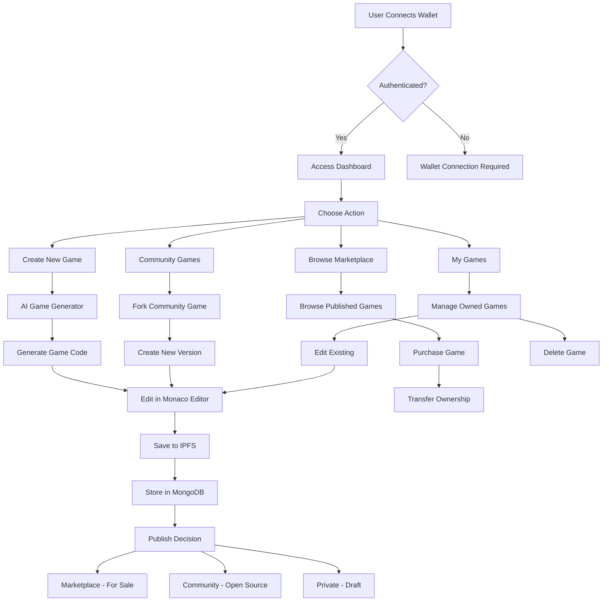

# 🎮 Gamie - AI-Powered Blockchain Game Platform

[](https://www.typescriptlang.org/)
[](https://nextjs.org/)
[](https://reactjs.org/)
[](https://ethereum.org/)
[](https://www.mongodb.com/)
[](https://tailwindcss.com/)

**Gamie** is a revolutionary blockchain-powered game platform that combines AI-generated game development with decentralized ownership and IPFS storage. Create, publish, and trade HTML5 games with wallet authentication on the Ethereum blockchain.

## 🌟 Features

### 🤖 AI-Powered Game Generation
- **Intelligent Code Generation**: Describe your game idea and let AI generate complete HTML5 game code instantly
- **Iterative Refinement**: Refine and improve games through AI-powered iterations
- **Multiple Game Templates**: Support for various game genres and mechanics

### 🔗 Blockchain Integration
- **Ethereum Wallet Authentication**: Secure ownership using MetaMask and other Web3 wallets
- **Decentralized Storage**: All games stored on IPFS via Pinata for permanent availability
- **Smart Contract Ready**: Built for future tokenization and NFT integration

### 🏪 Marketplace & Community
- **Game Marketplace**: Buy, sell, and trade games with other developers
- **Community Hub**: Share games for collaboration and forking
- **Version Control**: Track game versions with IPFS-backed history

### 🛠️ Developer Tools
- **Monaco Code Editor**: Full-featured in-browser code editor
- **Real-time Preview**: Live preview of games during development
- **Fork & Collaborate**: Fork community games and build upon them
- **Publishing System**: Publish to marketplace or community with one click

## 🏗️ Architecture Overview

### Frontend Stack
- **Next.js 15** with App Router for server-side rendering and routing
- **React 19** for component-based UI development
- **TypeScript** for type-safe development
- **TailwindCSS** for responsive styling
- **Shadcn/ui** for consistent component library

### Blockchain & Web3
- **Wagmi** for Ethereum wallet integration
- **Viem** for low-level Ethereum interactions
- **Support for Ethereum Mainnet and Sepolia testnet**

### AI & Code Generation
- **Google AI (Genkit)** for intelligent code generation
- **OpenAI integration** for advanced AI capabilities
- **Custom prompts** for game-specific code generation

### Backend & Storage
- **MongoDB** for game metadata and user data
- **IPFS (Pinata)** for decentralized file storage
- **Next.js API Routes** for serverless backend functionality

## 🚀 Getting Started

### Prerequisites
- **Node.js** 18.0 or later
- **pnpm** package manager
- **MongoDB** database
- **Pinata IPFS** account
- **Google AI API** key

### Installation

1. **Clone the repository**
   ```bash
   git clone https://github.com/Prathamesh-chougale-17/gamie.git
   cd gamie
   ```

2. **Install dependencies**
   ```bash
   pnpm install
   ```

3. **Environment Setup**
   Create a `.env.local` file in the root directory:
   ```env
   # Database
   MONGODB_URI=mongodb://localhost:27017/game-hub

   # AI Services
   GOOGLE_GENAI_API_KEY=your_google_ai_key
   OPENAI_API_KEY=your_openai_key

   # IPFS Storage
   PINATA_JWT=your_pinata_jwt_token

   # App Configuration
   NEXT_PUBLIC_APP_URL=http://localhost:3000
   ```

4. **Development Server**
   ```bash
   pnpm dev
   ```

   Open [http://localhost:3000](http://localhost:3000) in your browser.

## 🔄 Application Flow



## 📁 Project Structure

```
gamie/
├── app/                          # Next.js App Router
│   ├── (auth)/                   # Protected routes
│   │   ├── layout.tsx            # Authentication wrapper
│   │   ├── editor/               # Game editor pages
│   │   │   ├── page.tsx          # Editor dashboard
│   │   │   └── [id]/page.tsx     # Individual game editor
│   │   ├── marketplace/          # Marketplace pages
│   │   │   ├── page.tsx          # Marketplace listing
│   │   │   └── [id]/page.tsx     # Individual game page
│   │   ├── community/            # Community pages
│   │   │   ├── page.tsx          # Community listing
│   │   │   └── [id]/page.tsx     # Community game page
│   │   └── games/                # Game categories
│   ├── api/                      # API Routes
│   │   ├── games/                # Game management
│   │   │   ├── route.ts          # CRUD operations
│   │   │   ├── save/route.ts     # Save game data
│   │   │   ├── delete/route.ts   # Delete games
│   │   │   ├── fork/route.ts     # Fork games
│   │   │   ├── publish/route.ts  # Publish to marketplace/community
│   │   │   └── unpublish/route.ts# Unpublish games
│   │   ├── marketplace/route.ts  # Marketplace API
│   │   └── community/route.ts    # Community API
│   ├── globals.css               # Global styles
│   ├── layout.tsx                # Root layout with providers
│   └── page.tsx                  # Landing page
├── components/                   # React components
│   ├── canvas-forge/             # Game editor components
│   │   ├── CodeEditor.tsx        # Monaco editor wrapper
│   │   ├── Preview.tsx           # Game preview
│   │   ├── EnhancedGameGeneratorDialog.tsx # AI generator
│   │   └── Header.tsx            # Editor header
│   ├── wallet/                   # Wallet integration
│   │   ├── provider.tsx          # Wagmi provider setup
│   │   ├── connect-button.tsx    # Wallet connection
│   │   ├── chain-dropdown.tsx    # Network selector
│   │   ├── balance.tsx           # Balance display
│   │   └── auth-layout.tsx       # Authentication wrapper
│   ├── layout/                   # Layout components
│   │   ├── navbar.tsx            # Navigation bar
│   │   └── mobile-nav.tsx        # Mobile navigation
│   └── ui/                       # Shadcn UI components
├── lib/                          # Utility libraries
│   ├── game-service.ts           # Game business logic
│   ├── mongodb.ts                # Database connection
│   ├── utils.ts                  # Common utilities
│   └── constants.ts              # App constants
├── ai/                           # AI integration
│   ├── flows/                    # AI workflows
│   │   ├── generate-game-code.ts # Game generation flow
│   │   └── refine-prompt-flow.ts # Prompt refinement
│   ├── genkit.ts                 # AI configuration
│   └── config.ts                 # AI settings
└── types/                        # TypeScript definitions
    └── ai-sdk.ts                 # AI type definitions
```

## 🗄️ Database Schema

### Games Collection
```typescript
type Game = {
  _id?: string;
  gameId: string;              // Unique game identifier
  walletAddress: string;       // Owner's wallet address
  title: string;               // Game title
  description?: string;        // Game description
  tags?: string[];            // Game tags
  currentVersion: number;      // Current version number
  latestVersionHtml: string;   // Latest game code
  ipfsCid: string;            // IPFS content identifier
  ipfsUrl: string;            // IPFS access URL
  isPublishedToMarketplace: boolean;
  isPublishedToCommunity: boolean;
  marketplacePublishedAt?: Date;
  communityPublishedAt?: Date;
  isForSale?: boolean;
  salePrice?: number;
  originalGameId?: string;     // For forked games
  originalOwner?: string;      // Original creator
  createdAt: Date;
  updatedAt: Date;
};
```

### Game Versions Collection
```typescript
type GameVersion = {
  _id?: string;
  versionId: string;           // Version identifier
  gameId: string;              // Parent game ID
  version: number;             // Version number
  html: string;                // Game code
  title: string;               // Version title
  description?: string;        // Version description
  ipfsCid: string;            // IPFS storage
  ipfsUrl: string;            // IPFS URL
  createdAt: Date;
  updatedAt: Date;
};
```

## 🌐 API Endpoints

### Game Management
- `GET /api/games?wallet=address` - Get games by wallet
- `POST /api/games/save` - Save game data
- `POST /api/games/delete` - Delete game
- `POST /api/games/fork` - Fork existing game
- `POST /api/games/publish` - Publish to marketplace/community
- `POST /api/games/unpublish` - Remove from marketplace/community

### Marketplace
- `GET /api/marketplace` - Get marketplace games
- `GET /api/marketplace/[id]` - Get specific marketplace game
- `POST /api/games/buy` - Purchase game

### Community
- `GET /api/community` - Get community games
- `GET /api/community/[id]` - Get specific community game

## 🔐 Authentication & Security

### Wallet Authentication
- **MetaMask Integration**: Primary wallet connection method
- **Multi-wallet Support**: Compatible with various Ethereum wallets
- **Network Validation**: Ensures users are on supported networks
- **Signature Verification**: Cryptographic proof of ownership

### Data Security
- **IPFS Storage**: Immutable and decentralized file storage
- **MongoDB Encryption**: Secure database connections
- **Environment Variables**: Sensitive data protection
- **Input Validation**: Comprehensive request validation

## 🎨 UI/UX Features

### Responsive Design
- **Mobile-First**: Optimized for mobile devices
- **Desktop Enhancement**: Rich desktop experience
- **Cross-Browser**: Compatible with modern browsers

### Interactive Elements
- **Real-time Preview**: Live game preview while editing
- **Drag & Drop**: Intuitive file management
- **Keyboard Shortcuts**: Developer-friendly shortcuts
- **Loading States**: Smooth user feedback

## 🧪 Development

### Code Quality
- **TypeScript**: Full type safety
- **Biome**: Lightning-fast linting and formatting
- **Ultracite**: Strict code quality enforcement
- **Husky**: Git hooks for quality gates

### Testing
```bash
# Lint code
pnpm lint

# Format code
pnpm format

# Fix issues automatically
pnpm fix
```

### AI Development
```bash
# Start AI development server
pnpm genkit:dev

# Watch mode for AI changes
pnpm genkit:watch
```

## 🚀 Deployment

### Vercel (Recommended)
1. Connect your GitHub repository to Vercel
2. Configure environment variables in Vercel dashboard
3. Deploy automatically on push to main branch

### Environment Variables for Production
```env
MONGODB_URI=your_production_mongodb_uri
GOOGLE_GENAI_API_KEY=your_production_google_ai_key
OPENAI_API_KEY=your_production_openai_key
PINATA_JWT=your_production_pinata_jwt
NEXT_PUBLIC_APP_URL=https://your-domain.com
```

## 🗺️ Roadmap

### Phase 1: Core Platform ✅
- [x] Wallet authentication
- [x] AI game generation
- [x] IPFS integration
- [x] Basic marketplace

### Phase 2: Enhanced Features 🚧
- [ ] NFT integration for game ownership
- [ ] Advanced AI models
- [ ] Multiplayer game support
- [ ] Revenue sharing system

### Phase 3: Ecosystem Expansion 📋
- [ ] Mobile app
- [ ] Game analytics dashboard
- [ ] Developer monetization tools
- [ ] Cross-chain compatibility

## 🤝 Contributing

We welcome contributions! Please see our [Contributing Guide](CONTRIBUTING.md) for details.

### Development Workflow
1. Fork the repository
2. Create a feature branch: `git checkout -b feature/amazing-feature`
3. Commit changes: `git commit -m 'Add amazing feature'`
4. Push to branch: `git push origin feature/amazing-feature`
5. Open a Pull Request

## 📄 License

This project is licensed under the MIT License - see the [LICENSE](LICENSE) file for details.

## 🙏 Acknowledgments

- **Next.js Team** for the amazing framework
- **Ethereum Foundation** for blockchain infrastructure
- **Pinata** for IPFS storage solutions
- **Google AI** for intelligent code generation
- **Shadcn** for beautiful UI components

## 📞 Support

- **GitHub Issues**: [Report bugs and request features](https://github.com/Prathamesh-chougale-17/gamie/issues)
- **Documentation**: [Full documentation](https://gamie-docs.vercel.app)
- **Community**: [Join our Discord](https://discord.gg/gamie)

---

**Made with ❤️ by the Gamie Team**
