# 🏗️ Gamie Architecture & Flow Diagrams

This document contains detailed architectural diagrams and flow charts for the Gamie platform.

## 🌐 System Architecture

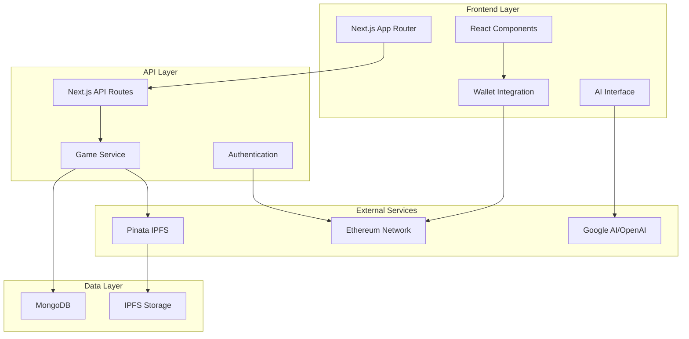

## 🔐 Authentication Flow

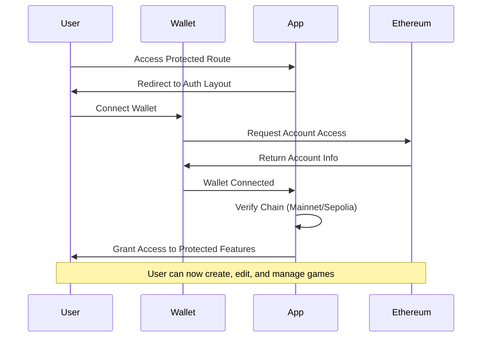

## 🎮 Game Creation Flow

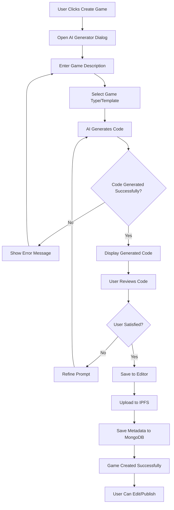

## 🏪 Marketplace Publishing Flow

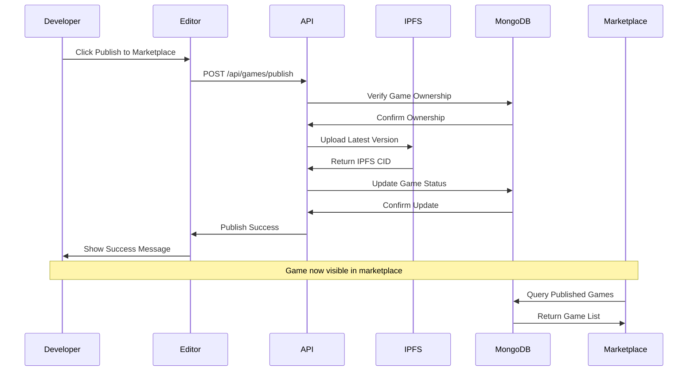

## 🔄 Game Forking Flow

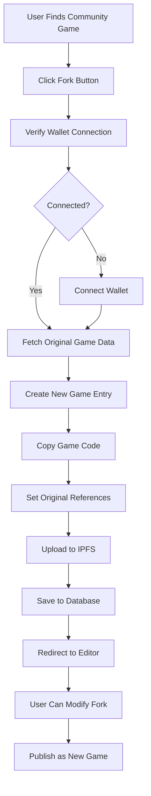

## 💰 Marketplace Purchase Flow

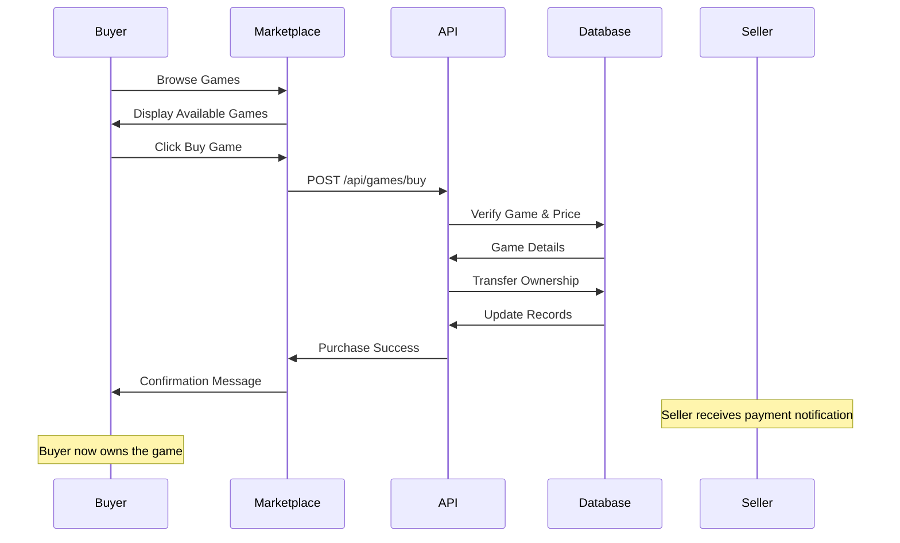

## 🔍 Search & Discovery Flow

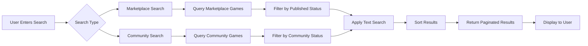

## 📊 Data Persistence Architecture

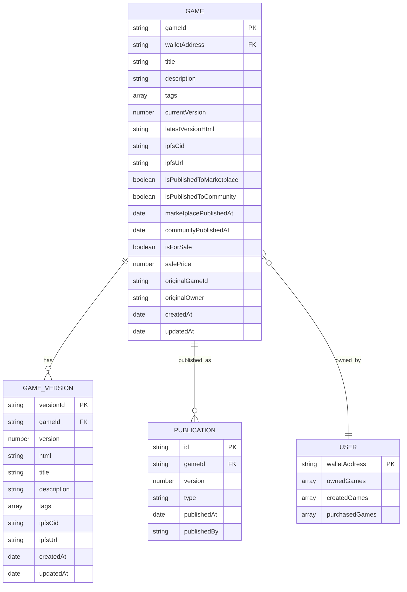

## 🚀 Deployment Architecture

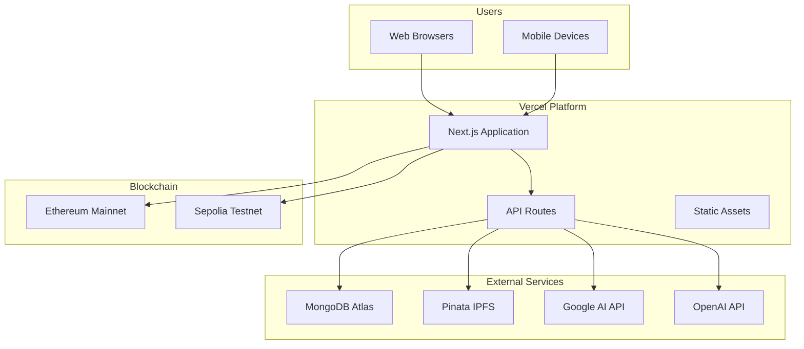

## 🔄 State Management Flow

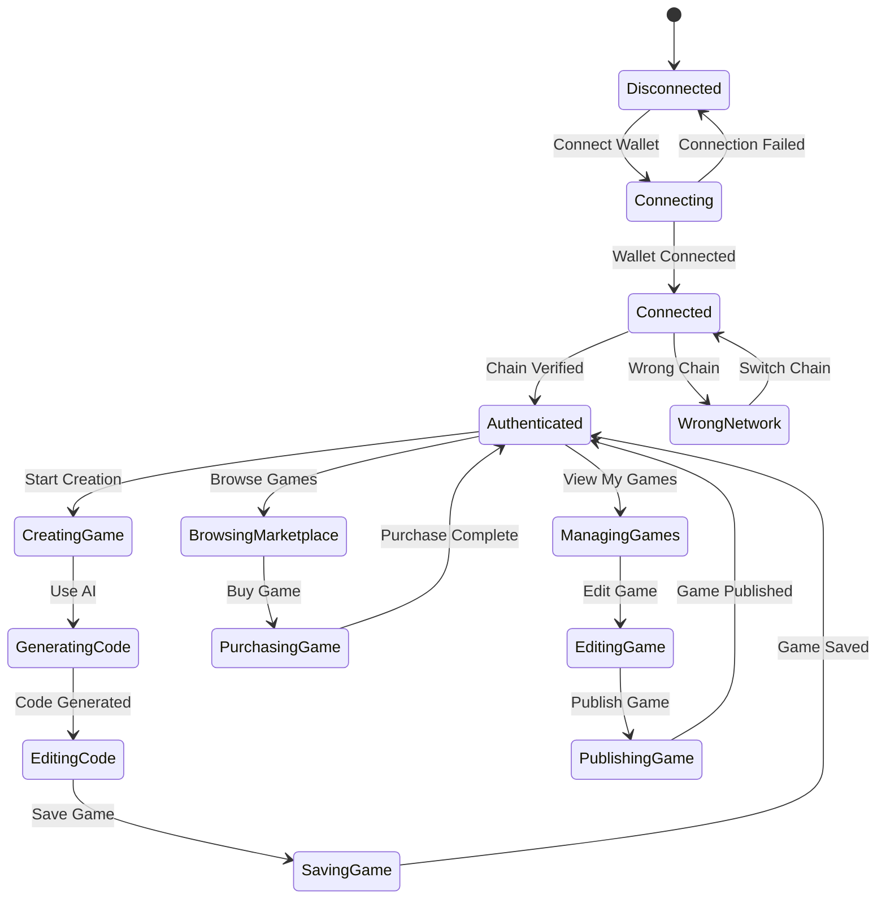

## 📱 Component Hierarchy

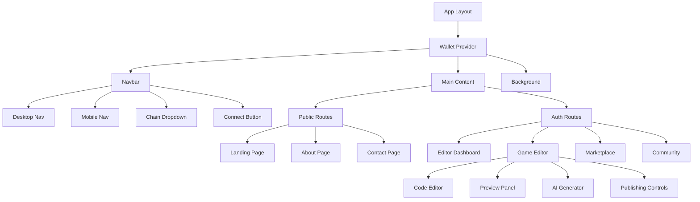

## 🔐 Security Architecture

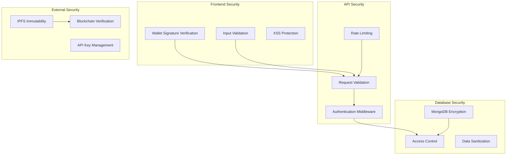

This comprehensive set of diagrams illustrates the complete architecture and flow of the Gamie platform, from user authentication through game creation, publishing, and marketplace interactions.